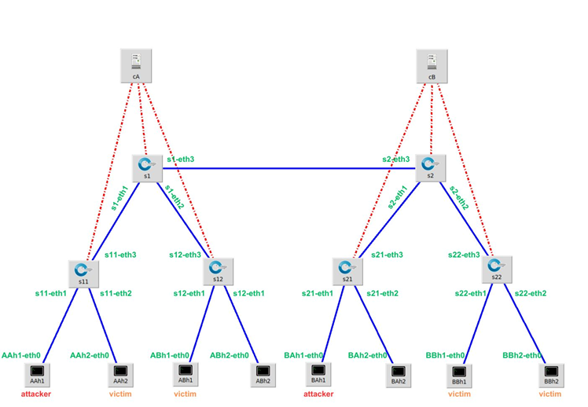

# Hệ thống IDS

- [Hệ thống IDS](#hệ-thống-ids)
  - [Thành viên nhóm:](#thành-viên-nhóm)
  - [Mô tả:](#mô-tả)
  - [Chú thích các file](#chú-thích-các-file)
  - [Run](#run)
  - [Tài liệu tham khảo:](#tài-liệu-tham-khảo)
## Thành viên nhóm:
|STT|Tên|MSSV|
|---|---|---|
| 1  |Đoàn Thế Lên|106200233|
| 2  |Lê Minh Nhật|106200238|

## Mô tả:
Dựa vào các kiến thực học được thông qua học phần Mạng định nghĩa bằng phần mềm
(SDN), cách sử dụng Mininet và Ryu. Nhóm xây dựng hệ thống phát hiện xâm nhập
(IDS) bằng cách sử dụng môi trường mô phỏng mạng Mininet và Ryu - công cụ tương tác
nhằm thu thập thông tin nhằm quản lý lưu lượng mạng.
Hệ thống bước đầu xây dựng nên chỉ ưu tiên xây dựng tính năng phát hiện các cuộc tấn
công DoS (viết tắt của Denial of Service) – tấn công Từ chối Dịch vụ


*Hình 1. Sơ đồ mạng mô phỏng với hệ thống gồm có 2 controller, 6 switches và 8 hosts*

## Chú thích các file
1. Chương trình tổng hợp gồm khởi tạo các tác vụ tạo mạng Mininet, theo dõi băng thông, giả lập tấn công và vẽ biểu đồ: ```net.py```
2. Chương trình theo dõi mạng ở nhánh 1: ```cont1.py```
3. Chương trình theo dõi mạng ở nhánh 2: ```cont2.py```\
4. Vẽ điểu đồ từ dữ liệu thu thập được ở file ```net.py``` gửi về: ```gui.py```
5. Tạo các kết nối mạng trong Mininet: ```interface.py```
6. Kết quả xuất ra sau khi chạy: ```plot.pdf```

## Run 
1. Trỏ đến đường dẫn của thư mục chứa code: ```cd SDN```
2. Mở Terminal thứ 1: ```sudo python net.py```

3. Mở Terminal thứ 2: 
```ryu-manager --ofp-tcp-listen-port 6633 cont1.py```
5. Mở Terminal thứ 3:
```ryu-manager --ofp-tcp-listen-port 6634 cont2.py```
6. Kết quả đầu ra sẽ mở trong cửa sổ bật ra và lưu với tên file ```plot.pdf ```

## Tài liệu tham khảo:
[Lập trình Mininet](https://github.com/pmanzoni/hackmd_code.git)
[Hping3](https://www.kali.org/tools/hping3/)
